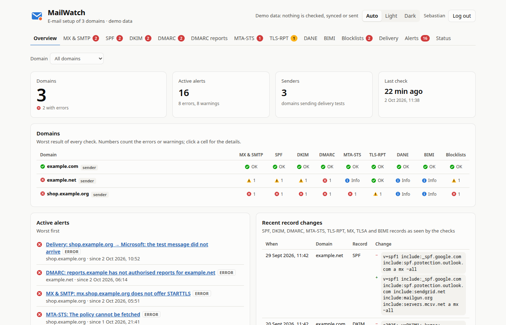

# MailWatch

> [!NOTE]
> This project was created with [Anthropic Claude Opus 5.5](https://www.anthropic.com/claude).

A self-hosted dashboard that keeps an eye on the e-mail setup of many domains:

- **DNS and server checks** of every domain, every `CHECK_INTERVAL_MINUTES`: MX and the SMTP
  service on port 25 (STARTTLS, TLS version, certificates), SPF, DKIM, DMARC, MTA-STS,
  TLS-RPT, DANE (with DNSSEC), BIMI and DNS blocklists.
- **Report analysis**: DMARC aggregate reports (rua), DMARC failure reports (ruf) and SMTP
  TLS reports (TLS-RPT, everything the [tlsrpt](../tlsrpt) dashboard does), read from one or
  more IMAP mailboxes.
- **Delivery tests**: every sender domain sends a test message to every recipient mailbox
  (e.g. at Gmail and Outlook.com) on its own interval. MailWatch finds it in the Inbox or the
  Junk folder and records the delivery time and how the provider authenticated it (SPF, DKIM,
  DMARC, Microsoft's compauth and spam score).
- **Alerts** like in zdwatch: warnings and errors become alerts with a lifecycle, announced on
  Telegram, with acknowledgements, snoozes and quiet hours. Changed DNS records are logged and
  announced.

Every finding has a level (**error** = broken configuration, **warning**, **info**, **OK**) and
cites the RFC section it is based on. Every tab lists its relevant specifications and marks
those that current warnings or errors cite.

Opening the dashboard **requires an OpenID Connect login** and membership of an allowed group,
as in tlsrpt and zdwatch. Design choices are recorded in [DECISIONS.md](DECISIONS.md).



## What is checked

| Tab               | Checks                                                                                                                                                                                                                                                                                                                                                         | Specifications                                           |
| ----------------- | -------------------------------------------------------------------------------------------------------------------------------------------------------------------------------------------------------------------------------------------------------------------------------------------------------------------------------------------------------------- | -------------------------------------------------------- |
| **Domain**        | registration via RDAP (IANA bootstrap): expiry (warning within `REGISTRATION_WARN_DAYS`, error within 7 days), hold and pending-delete status, registry vs zone nameservers; the nameservers: at least two, with addresses, not all in one /24, each queried directly (authoritative, same SOA serial)                                                         | RFC 9083, 9224, 8056, 1034, 2182, 1912                   |
| **MX & SMTP**     | MX records, Null MX, implicit MX, CNAME targets, addresses, private IPs, reverse DNS (forward-confirmed), IPv6; on port 25 of every MX: banner, EHLO, STARTTLS, TLS version (1.0/1.1 are errors), certificate trust, name and expiry                                                                                                                           | RFC 5321, 7505, 2181, 3207, 8996, 9525, 1912, 8689, 6531 |
| **SPF**           | exactly one record, syntax, the include/redirect tree, the 10-lookup and 2-void-lookup limits, loops, `+all`/`?all`/missing `all`, `ptr`, terms after `all`, record size                                                                                                                                                                                       | RFC 7208                                                 |
| **DKIM**          | key records of configured selectors, of selectors seen in DMARC reports and delivery tests, and of common selectors; key type and size (RSA < 1024 is an error, < 2048 a warning), `t=y`, `h=sha1`, `s=`, revoked keys, duplicates                                                                                                                             | RFC 6376, 8301, 8463, M3AAWG                             |
| **DMARC**         | exactly one record (with the DMARCbis tree walk for subdomains), `p`/`sp`/`np`, `pct`, alignment, `fo`/`rf`/`ri`, report URIs, external report destinations authorised (`<domain>._report._dmarc.<dest>`), whether MailWatch reads the report mailbox                                                                                                          | RFC 7489, DMARCbis                                       |
| **DMARC reports** | aggregate reports: pass rate over time, sending sources with reverse DNS, sources that fail partly (a legitimate sender with a problem), sources that sign with another domain (a service sending as you), p=none, overrides (forwarding), DKIM selectors, silent reporters; failure reports with the original headers                                         | RFC 7489 §7, RFC 6591, 5965, 6651, 6652, DMARCbis drafts |
| **MTA-STS**       | the `_mta-sts` record and its id, the policy fetched over HTTPS (valid certificate, no redirect, `text/plain`), syntax, mode, `max_age`, every MX covered by a pattern and presenting a valid certificate, a changed policy without a new id                                                                                                                   | RFC 8461, 9525                                           |
| **TLS-RPT**       | the `_smtp._tls` record and its destinations, then the full analysis of the TLS reports received (as in tlsrpt)                                                                                                                                                                                                                                                | RFC 8460                                                 |
| **DANE**          | DNSSEC on the domain and the MX records, TLSA records at `_25._tcp.<mx>`, validated or not, PKIX usages, and whether they match the certificate chain the MX presents                                                                                                                                                                                          | RFC 7672, 6698, 7671, 4033, 4034, 4035, 8624             |
| **BIMI**          | the `default._bimi` record, DMARC enforcement, the logo (HTTPS, SVG Tiny PS, no scripts, size), the mark certificate                                                                                                                                                                                                                                           | BIMI draft                                               |
| **Blocklists**    | MX IPs, configured and observed sender IPs, and the domain, on DNS blocklists                                                                                                                                                                                                                                                                                  | RFC 5782                                                 |
| **Sending**       | the sending IPs (configured and seen by delivery tests): reverse DNS, forward-confirmed, SPF `check_host()` for the envelope domain; the submission server (`DOMAIN_n_SMTPHOST`) and IMAP server (`DOMAIN_n_IMAPHOST`): TLS version, certificate, AUTH before STARTTLS; SRV records and autoconfig for mail clients; a Gmail/Yahoo sender requirements summary | RFC 7208, 8314, 4954, 6186, 8996, Gmail/Yahoo guidelines |
| **Delivery**      | sender × recipient matrix: inbox, junk, not delivered or not sent; delivery time; SPF/DKIM/DMARC as the recipient saw them; the received headers                                                                                                                                                                                                               | RFC 8601, 5321, 7208, 6376, 7489, 8617                   |

The **Overview** shows every domain × check, the active alerts and the latest record changes;
**Alerts** the alert history, snoozes and acknowledgements; **Status** the jobs, mailboxes,
recipients and notification settings.

## Requirements

- Node.js ≥ 26 (see `.nvmrc`). The TypeScript server runs directly, with no build step.
- MariaDB (tested with 12.3 LTS). For development, `compose.yaml` provides one.
- Outbound DNS (UDP/TCP 53) to validating resolvers, HTTPS, and **port 25** for the MX probes.
  Many cloud and home networks block outbound port 25; set `SMTP_PROBE=false` there.

## Configuration

Copy `.env.example` to `.env`; it documents every variable. All settings are environment
variables.

### Domains, senders and recipients

```sh
DOMAIN_1_NAME=wemail.no               # checked
DOMAIN_1_SMTPHOST=smtp.wemail.no      # with SMTP settings, also sends delivery tests
DOMAIN_1_SMTPPORT=465
DOMAIN_1_SMTPUSER=tester@wemail.no
DOMAIN_1_SMTPPASS=…                   # or DOMAIN_1_SMTPPASSWORD
# DOMAIN_1_SEND_INTERVAL_MINUTES=60   # default DELIVERY_INTERVAL_MINUTES; 0 = do not send
# DOMAIN_1_DKIM_SELECTORS=s1,s2

RECIPIENT_1_NAME=GMail
RECIPIENT_1_IMAPHOST=imap.gmail.com
RECIPIENT_1_IMAPPORT=993
RECIPIENT_1_IMAPUSER=mygmailuser@gmail.com
RECIPIENT_1_IMAPPASSWORD=…            # or RECIPIENT_1_IMAPPASS
```

`n` may have gaps and fixes the order. Domains without SMTP settings are only checked. Every
sender sends one test message to every recipient per interval, from `DOMAIN_n_FROM` (default:
the SMTP user). Use dedicated test mailboxes: MailWatch moves the test messages it finds to
the trash (`RECIPIENT_n_KEEP_MESSAGES=true` leaves them).

| Variable                                             | Default                          |                                               |
| ---------------------------------------------------- | -------------------------------- | --------------------------------------------- |
| `DOMAIN_n_NAME`                                      | –                                | required                                      |
| `DOMAIN_n_SMTPHOST`, `_SMTPUSER`, `_SMTPPASS`        | –                                | all or none                                   |
| `DOMAIN_n_SMTPPORT` / `_SMTPTLS`                     | `465` / `true` on 465            | other ports must offer STARTTLS               |
| `DOMAIN_n_FROM`                                      | the SMTP user                    |                                               |
| `DOMAIN_n_SEND_INTERVAL_MINUTES`                     | `DELIVERY_INTERVAL_MINUTES` (60) | `0` = never send                              |
| `DOMAIN_n_DKIM_SELECTORS`                            | –                                | DKIM selectors cannot be listed from DNS      |
| `DOMAIN_n_SENDER_IPS`                                | –                                | outbound IPs: blocklists, reverse DNS, SPF    |
| `DOMAIN_n_IMAPHOST` / `_IMAPPORT`                    | – / `993`                        | the domain's IMAP server, checked for TLS     |
| `RECIPIENT_n_IMAPHOST`, `_IMAPUSER`, `_IMAPPASSWORD` | –                                | or OAuth2, see below                          |
| `RECIPIENT_n_IMAPPORT` / `_IMAPTLS`                  | `993` / `true` on 993            |                                               |
| `RECIPIENT_n_NAME` / `_ADDRESS`                      | the address / the IMAP user      |                                               |
| `RECIPIENT_n_FOLDERS`                                | `INBOX` + the `\Junk` folder     |                                               |
| `DELIVERY_TIMEOUT_MINUTES` / `DELIVERY_POLL_SECONDS` | `30` / `60`                      | not found after the timeout = "not delivered" |
| `DELIVERY_RETENTION_DAYS`                            | `90`                             |                                               |

**Gmail:** the IMAP host is `imap.gmail.com`. Use an [app password](https://myaccount.google.com/apppasswords)
(needs 2-step verification).

**Outlook.com / Microsoft 365:** Microsoft no longer accepts passwords over IMAP. Use OAuth2:
register an app in Microsoft Entra (personal accounts: "Accounts in any organizational
directory and personal Microsoft accounts"), add the delegated permission
`IMAP.AccessAsUser.All` and `offline_access`, obtain a refresh token once (e.g. with the
device code flow), and configure:

```sh
RECIPIENT_2_IMAPHOST=outlook.office365.com
RECIPIENT_2_IMAPUSER=myoutlookuser@outlook.com
RECIPIENT_2_OAUTH_TOKEN_URL=https://login.microsoftonline.com/consumers/oauth2/v2.0/token
RECIPIENT_2_OAUTH_CLIENT_ID=…
RECIPIENT_2_OAUTH_REFRESH_TOKEN=…
# RECIPIENT_2_OAUTH_CLIENT_SECRET=…    # confidential clients only
# RECIPIENT_2_OAUTH_SCOPE=https://outlook.office.com/IMAP.AccessAsUser.All offline_access
```

Microsoft rotates refresh tokens; MailWatch keeps the newest one in the database. OAuth2 works
the same way for report mailboxes (`MAILBOX_n_OAUTH_…`) and for Gmail.

### Report mailboxes

```sh
MAILBOX_1_IMAPHOST=imap.example.com
MAILBOX_1_IMAPUSER=dmarc@example.com
MAILBOX_1_IMAPPASS=…
# MAILBOX_1_FOLDER=INBOX
# MAILBOX_1_ADDRESS=dmarc@example.com   # as in rua=/ruf=, to mark the destination as monitored
```

Point `rua=`/`ruf=` of your DMARC records and `rua=` of your TLS-RPT records at these
mailboxes. One mailbox may receive all three kinds: every message is classified by its content
(zip, gzip or plain XML/JSON; ARF for failure reports). The mailboxes are opened read-only
(`EXAMINE`) and read incrementally by UID, as in tlsrpt. `MAILBOX_n_DELETE_AFTER_MONTHS`
enables tlsrpt's opt-in cleanup of old imported messages (`MAILBOX_n_DELETE_DRY_RUN=true`
first). Of failure reports, only the report fields and the original headers are stored, never
message bodies.

### Checks, alerts and the rest

| Variable                                                      | Default                                              |                                                                                                          |
| ------------------------------------------------------------- | ---------------------------------------------------- | -------------------------------------------------------------------------------------------------------- |
| `CHECK_INTERVAL_MINUTES` / `CHECK_CONCURRENCY`                | `15` / `4`                                           | `0` = manual only                                                                                        |
| `REPORT_SYNC_INTERVAL_MINUTES`                                | `30`                                                 |                                                                                                          |
| `REPORT_ANALYSIS_DAYS`                                        | `7`                                                  | window of the report-based alerts                                                                        |
| `REPORT_SILENT_DAYS`                                          | `3`                                                  | warn when a domain's DMARC or TLS reports stop (after 30 days with reports); `0` = off                   |
| `DNS_RESOLVERS`                                               | `1.1.1.1,8.8.8.8`                                    | must validate DNSSEC; `system` = the OS resolvers                                                        |
| `SMTP_PROBE` / `SMTP_HELO_NAME`                               | `true` / the `PUBLIC_URL` host                       |                                                                                                          |
| `CERT_WARN_DAYS`                                              | `21`                                                 | expiry warning; within 7 days an error                                                                   |
| `RDAP_CHECK` / `REGISTRATION_WARN_DAYS`                       | `true` / `30`                                        | registration lookup (cached a day); expiry warning, within 7 days an error                               |
| `NS_CHECK`                                                    | `true`                                               | query every nameserver directly; `false` where outbound DNS is blocked                                   |
| `DNSSEC_SIG_WARN_DAYS`                                        | `3`                                                  | RRSIG expiry warning, only when also less than a quarter of the validity is left                         |
| `DKIM_KEY_MAX_AGE_DAYS`                                       | `365`                                                | warn about DKIM keys older than this; `0` = off                                                          |
| `DKIM_COMMON_SELECTORS`                                       | `default,dkim,mail,selector1,selector2,…`            | empty = only configured and observed ones                                                                |
| `DNSBL_ZONES` / `DNSBL_DOMAIN_ZONES`                          | Spamhaus ZEN, SpamCop, PSBL, Mailspike / DBL, SURBL  | Spamhaus and SURBL refuse public resolvers: shown as "unknown"                                           |
| `DNSBL_RESOLVERS`                                             | `DNS_RESOLVERS`                                      | resolvers for the blocklist lookups only, e.g. your own recursive resolver (Unbound); `system` works too |
| `SPAMHAUS_DQS_KEY`                                            | –                                                    | Spamhaus Data Query Service key: Spamhaus zones are queried through DQS; the key is never shown          |
| `ALERT_CONFIRMATIONS`                                         | `2`                                                  | consecutive checks a finding must be seen in before it alerts                                            |
| `TELEGRAM_TOKEN`, `TELEGRAM_CHAT_ID`, `TELEGRAM_THREAD_ID`    | –                                                    | optional                                                                                                 |
| `TIMEZONE`                                                    | `UTC`                                                | times in the UI, in alerts and of quiet hours                                                            |
| `DB_HOST` / `DB_PORT` / `DB_USER` / `DB_PASSWORD` / `DB_NAME` | `127.0.0.1` / `3306` / `mailwatch` / – / `mailwatch` | schema is created at startup                                                                             |
| `LISTEN_HOST` / `PORT`                                        | `127.0.0.1` / `3000`                                 | `0.0.0.0` in containers                                                                                  |
| `PUBLIC_URL`, `OIDC_*`, `SESSION_TTL_HOURS`                   | –                                                    | as in tlsrpt/zdwatch; `OIDC_EDITOR_GROUPS` may change settings and send tests                            |

**Alerts:** a warning or error opens an alert once it is seen in `ALERT_CONFIRMATIONS`
consecutive checks, and resolves as soon as it is gone. A check whose DNS lookup failed keeps
its alerts as they are. Delivery tests alert on "not delivered", "junk", "not sent" and on a
failing DMARC result at the recipient; the reports alert on partly failing or unaligned
sources, failing DKIM selectors, TLS failure rates, and reports that stopped arriving;
unreadable mailboxes alert too. On the
Status tab, editors set the minimum severity sent to Telegram (default warning), quiet hours,
and whether record changes are announced.

### OIDC

Exactly as in tlsrpt and zdwatch: register `${PUBLIC_URL}/auth/callback` (post-logout
`${PUBLIC_URL}/`), set `OIDC_ISSUER`, `OIDC_CLIENT_ID`, `OIDC_CLIENT_SECRET` and
`OIDC_ALLOWED_GROUPS`. `OIDC_EDITOR_GROUPS` restricts who may change the settings, send a
Telegram test and send delivery tests on demand; acknowledging and snoozing alerts is open to
every user.

## Development

```sh
npm install
docker compose up -d         # MariaDB on 127.0.0.1:3308 (--profile oidc: mock OIDC; --profile imap: test IMAP)

npm run dev                  # API on :3000 + Vite dev server on http://localhost:5173
npm run check-domain -- example.com   # run every check from the command line, without a database
npm run sync                 # one-off sync of the report mailboxes (-- --full to rescan)
npm run demo                 # serve synthetic data from the mailwatch_demo database (login still required)
npm run check                # typecheck + eslint + prettier + tests (what CI runs)
npm run build                # build the UI into dist/web
npm start                    # serve API + built UI on http://127.0.0.1:3000
```

The integration tests run when `TEST_DB_HOST` (MariaDB) and `TEST_IMAP_HOST` (the disposable
Dovecot from `docker compose --profile imap`) are set; see `.env.example`. They create their
own `mailwatch_test*` databases and random IMAP users. Without them, only the unit tests run.
The check tests use a fake DNS zone and never touch the network.

`npm run check-domain` prints every finding with its RFC references, e.g.:

```
wemail.no
  ⚠ dkim (48 ms)
      ✔ Selector "s1": 2048-bit RSA key [RFC 8301]
      ⚠ Selector "s2": 1024-bit RSA key [RFC 8301 §3.2]
```

## Release & deployment

As in tlsrpt: [.github/workflows/release.yaml](.github/workflows/release.yaml) runs
`npm run check` and the build on every push and pull request (with MariaDB and Dovecot service
containers). On `master` it publishes a cosign-signed `mailwatch.tar.xz` and a multi-arch image
`ghcr.io/<owner>/mailwatch` built from the multi-stage [Dockerfile](Dockerfile) on Docker
Hardened Images (needs the `DHI_USERNAME` variable and `DHI_TOKEN` secret).

```sh
docker run -d --name mailwatch -p 3000:3000 --read-only --cap-drop ALL \
  --env-file mailwatch.env ghcr.io/<owner>/mailwatch:latest
```

The container needs outbound DNS, HTTPS, IMAP, SMTP submission and port 25. Several replicas
are fine: checks, syncs, sending and alert evaluation are serialised with MariaDB locks.

## API

|                                                                         |                                                       |
| ----------------------------------------------------------------------- | ----------------------------------------------------- |
| `GET /api/overview`                                                     | worst result per domain and check                     |
| `GET /api/checks/:check?domain=`                                        | latest results with findings and details              |
| `POST /api/checks/run`                                                  | run the checks now (optionally `{ "domain": … }`)     |
| `GET /api/changes?domain=&check=`                                       | record change history                                 |
| `GET /api/dmarc/overview\|reports\|reports/:id\|failures\|failures/:id` | DMARC report analysis (`from`, `to`, `domain`, `org`) |
| `GET /api/tls/overview\|reports\|reports/:id`                           | TLS report analysis (same filters)                    |
| `POST /api/reports/sync`                                                | sync the report mailboxes now                         |
| `GET /api/delivery?days=`, `GET /api/delivery/probes/:id`               | delivery tests                                        |
| `POST /api/delivery/run`                                                | send test messages now (editors)                      |
| `GET /api/alerts`, `POST /api/alerts/:id/ack\|snooze`, `/api/snoozes`   | alerts                                                |
| `GET/PUT /api/settings`, `POST /api/telegram/test`                      | notification settings (editors may change them)       |
| `GET /api/status`, `GET /api/me`, `GET /api/health`                     | status, user, liveness (no login)                     |

## Layout

```
src/server/          config, HTTP API, OIDC, MariaDB store, scheduling (monitor), alerts + Telegram
src/server/checks/   one module per check, the SMTP probe, the runner
src/server/reports/  TLS-RPT, DMARC aggregate and ARF parsing, report analysis
src/server/dns.ts    DNS stub resolver with rcode and DNSSEC AD flag
src/server/delivery.ts, auth-results.ts   delivery tests
src/shared/          types, RFC catalogue, UI paths
src/web/             React UI (hand-drawn SVG charts)
scripts/             release bundle, demo data
test/                unit and integration tests, fixtures (incl. a throwaway test-only TLS key)
```
